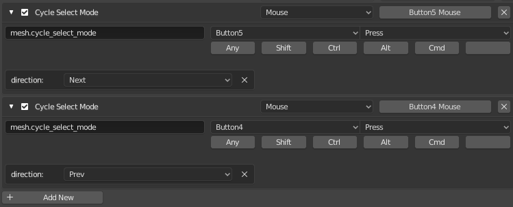

# Cycle Select Mode - Blender Add-on

## Description

Cycle Select Mode is a Blender addon that provides an operator that can cycle through the
'VERT', 'EDGE' and 'FACE' select modes. It has a single property 'direction' that allows
cycling forwards or backwards. It's most useful when bound to easy to get to buttons such
as mouse thumb buttons. It's possible that this functionality is present in Blender though
I couldn't find it and if nothing else this was a fun way to jump into the Blender Python
API.

## Keymap

Add keymaps similar to below in the **3D View** > **Mesh** > **Mesh(Global)** keymap section.

