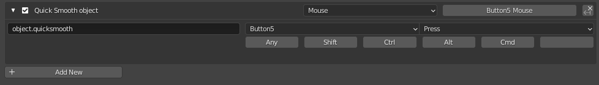

# Quick Smooth - Blender Add-on

## Description

Quick Smooth toggles objects between two states:

- Flat Shaded / Auto Smooth Off
- Smooth Shaded / Auto Smooth On (30 degrees)

I have it bound to a spare mouse button so I can smooth objects as soon as I make them.

## Keymap

Add a keymap similar to below in the **3D View** > **Object** > **Object(Global)** keymap section.

